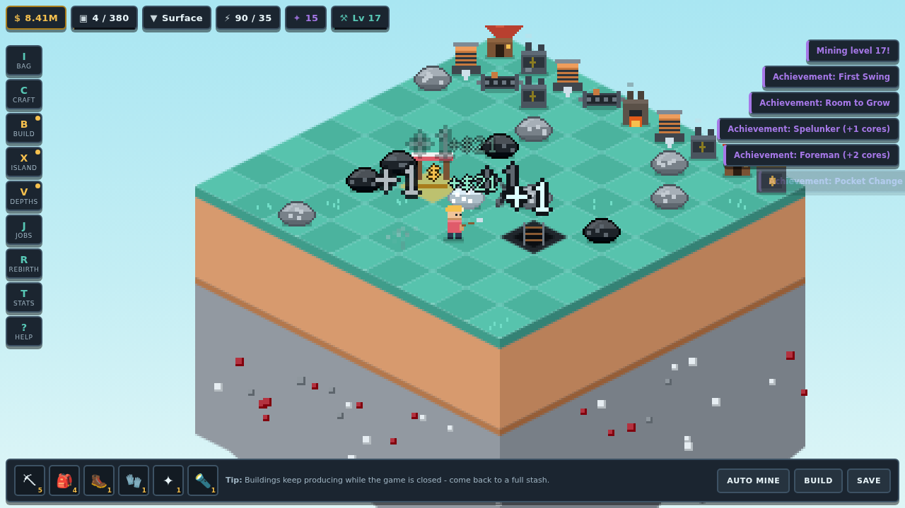
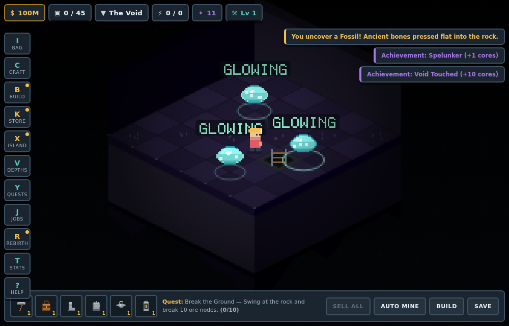
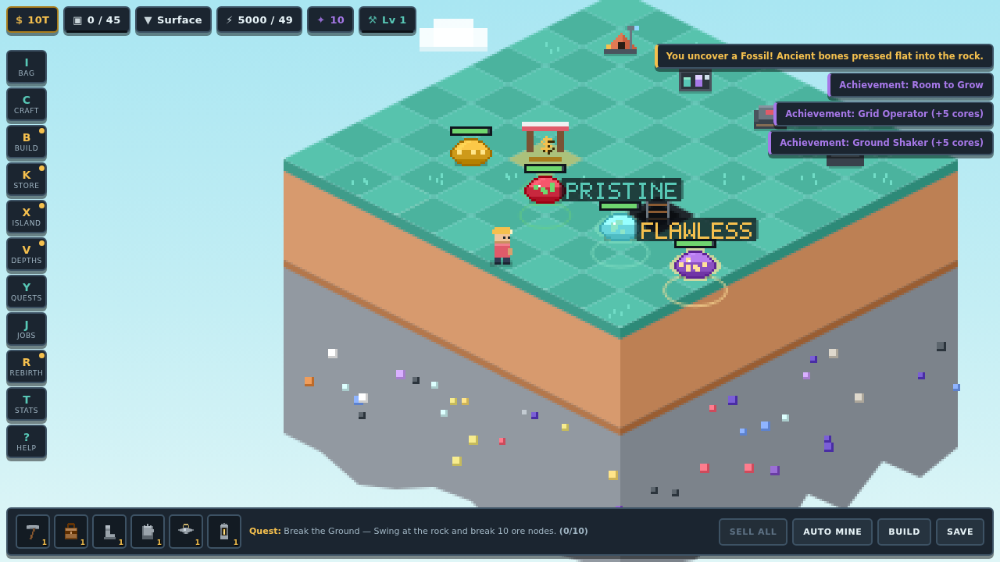
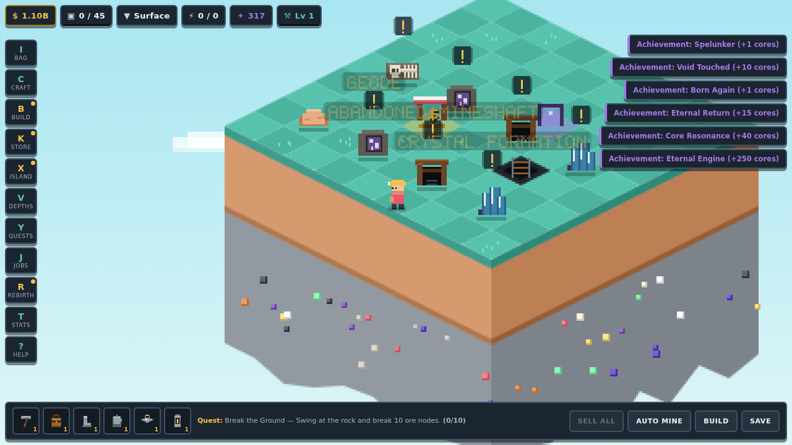
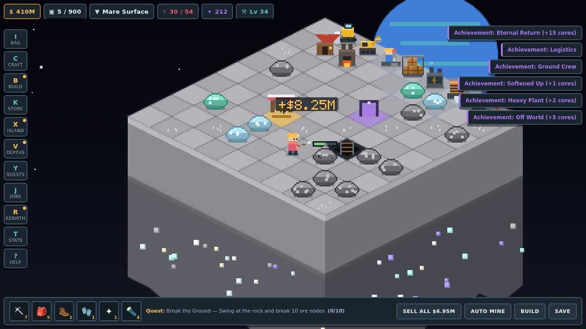

# Sky Shard Tycoon

A floating-island mining tycoon that runs entirely in the browser. No build step,
no dependencies, no assets — the whole world is drawn with `fillRect` into a
low-resolution buffer that is scaled up with nearest-neighbour filtering, so it
comes out as honest chunky pixel art.

You start alone on a six-by-six shard of rock hanging in a pale blue sky. You
swing a wooden pickaxe at boulders, carry the ore to a market stall, and slowly
turn that into machines, a bigger island, caves beneath it, and eventually a
reason to blow the whole thing up and start again richer.




*Glowing seams light the rock around them. In The Void that is the only light there is.*


*Graded seams glow and name themselves. Pristine pays 12x the ore, Flawless a full 40x.*


*Six kinds of buried find, uncovered and still mounded. Walk within a few tiles to spot one.*


*Rebirth five times and the shard flies to the Moon: low gravity, Earth overhead, and ore worth two hundred times what the home island pays.*

## Getting started

A new save opens with an eleven-step tutorial that watches the real game state —
nothing is scripted or faked, you genuinely do each thing. It walks you from your
first steps through mining, selling, crafting, the warehouse, automation, bulk
selling, the quest log and the travel screen, pointing an arrow at the market pad
and pulsing the menu button you need. It can be skipped at any point and replayed
from the Field Manual.

## Play

Open `index.html` in any modern browser, or serve the folder:

```sh
python3 -m http.server 8000
# then visit http://localhost:8000
```

Progress saves to `localStorage` every 15 seconds and whenever the tab closes.
The Field Manual panel can export the save as a string and paste one back in.

## Controls

| Action | Key |
| --- | --- |
| Move | `W` `A` `S` `D` or the arrow keys |
| Swing the pickaxe | hold `SPACE` (auto-swing is on by default) |
| Sell the whole bag at once | `F`, or the SELL ALL button |
| Walk somewhere | click a tile |
| Ride the mineshaft down / up | `E` / `Q` |
| Open Travel from the warp gate | `E` while standing on it |
| Place or demolish a building | click / right-click in build mode |
| Zoom | `+` `-` or the scroll wheel |
| Panels | `I` bag, `C` craft, `B` build, `K` warehouse, `X` island, `V` depths, `Y` quests, `J` jobs, `R` rebirth, `T` records, `?` help |
| Mute | `M` |
| Close a panel | `ESC` |

On phones and tablets a D-pad, a MINE button and a USE button appear
automatically.

## The loop

1. **Mine.** Stand next to a boulder and swing. Ore goes into your bag, which has
   a hard capacity.
2. **Sell.** Walk onto the golden market pad to cash out at full price, or press
   `F` anywhere to dump the whole bag in one go — on the pad that empties your
   warehouses of anything not marked *keep* as well. Selling from the field
   costs a 25% courier fee until you own a conveyor.
3. **Craft.** Six independent upgrade chains — pickaxe, bag, boots, gloves, charm
   and lantern — each cost ore plus cash, and each gates behind a mining level.
4. **Store.** A warehouse holds ore outside your bag. Tick the ore types you want
   to *keep*: those are dropped off whenever you walk past a warehouse, are never
   sold by the market pad, your conveyors or machine overflow, and still count
   towards recipes and contracts. Everything you leave on *sell* behaves as
   before, so building one never quietly switches off your income.
5. **Build.** Twenty-four machines work around the clock, including while the
   game is closed. Huts, drills, excavators, deep rigs, tunnel borers and
   quantum bores dig; generators, reactors and fusion plants power them;
   conveyors and mag conveyors ship ore to market; smelters, vaults and
   refineries raise the price. Bulldozers clear rubble so veins respawn faster,
   jackhammer crews boost *your* own swing, ore scanners surface rarer ore and
   blast sheds double your drops. Prospector's camps turn up more buried finds,
   assay offices push seams up a grade, and a seismic array cracks every node
   on your layer at once.
6. **Expand.** A wider island carries more ore veins on every layer and more room
   for machines, up to 20×20.
7. **Dig deeper.** Six layers per dimension. Each multiplies both rock toughness
   and ore value, and your buildings always work the deepest layer you own.
8. **Fly somewhere new.** Rebirth milestones unlock whole dimensions, each with
   its own ore table, palette, depth names and rules:

   | Dimension | Unlocks at | Twist |
   | --- | --- | --- |
   | Sky Shard | start | home |
   | The Moon | 5 rebirths | low gravity: +45% move speed, veins respawn 30% slower |
   | The Asteroid Belt | 15 rebirths | dense pockets: +25% double drops |
   | The Solar Forge | 30 rebirths | blistering heat: machines 2x, your swing 20% slower |
   | Nebula Reach | 60 rebirths | strange matter: rare ore twice as likely, very dark |
   | The Singularity | 100 rebirths | time dilation: machines 3x, your hands at half speed |

   Average ore runs from $5.65K at home to $3.95Qa in The Singularity, and the
   rock gets proportionally harder, so each one gates itself on your mining power.
9. **Take contracts.** The sky guild posts three delivery jobs at a time that pay
   roughly triple the market rate plus a lump of experience.
10. **Follow the quest log.** Thirty-one quests form one long chain that carries
   across rebirths, from breaking your first ten nodes to earning a trillion
   dollars. They complete themselves the moment you meet them.
11. **Rebirth.** Once a life has earned enough, trade the island, the money, the
    gear and the machines for Prestige Cores. Cores are permanent (+3% money and
    +1% mining power each) and buy twelve stacking perks. Twelve **rebirth
    milestones** unlock on rebirth count alone — seed money at 3, the Shallow
    Caves pre-opened at 5, a wider starting island at 12, a prefab camp at 35,
    double cores at 100.

## Mechanics in the box

- Fifty-six ores across six dimensions, each with its own spawn weights per depth
- **Ore grades**: every node rolls Common, Rich (4x ore), Pristine (12x) or
  Flawless (40x) when it spawns. Graded rock glows, rings the ground and names
  itself, and your luck widens every band - which is what finally makes
  lanterns, scanners and assay offices worth stacking
- **Mutations**: a second, far rarer roll that changes what the ore is *worth*
  rather than how much of it you get, and stacks with the grade. Cracked (x0.15),
  Contaminated (x0.3) and Impure (x0.55) spoil a seam; Shiny (x2.5), Pure (x6),
  Glowing (x15, and it lights the cave), Radioactive (x40) and Ancient (x120)
  make one. Mutated ore is its own stack in your bag, crafting spends the junk
  first, and luck pushes the roll away from slag and towards treasure
- Node health, cracking, damage numbers and respawn timers
- Six buried structures - fossils, geodes, abandoned mineshafts, crystal
  formations, meteorites and void rifts - that appear as loose mounds until
  you walk close, are far tougher than ordinary rock, and pay in one lump
- Mining levels and experience, feeding power and movement speed
- Carry capacity with overflow auto-selling so idle progress never fully stalls
- Warehouses with per-ore keep/sell selection, feeding crafting and contracts
- A power grid: drills run at reduced efficiency when generators cannot keep up
- Offline production with a configurable rate and an eight-hour cap
- Six dimensions with their own ore tables, skies, planets and rules
- A 31-quest chain with live progress tracking in the action bar
- Seven milestone tracks, eight tiers each, paying permanent stacking bonuses
  read from all-time totals so they survive every rebirth
- Sixteen rebirth milestones keyed to rebirth count alone, five of which
  unlock a dimension
- Forty-one achievements paying out cash and cores
- Repeatable guild contracts with a reroll cost, restricted to ore you can
  actually reach
- Twelve prestige perks including Head Start, which seeds the next run with gear
- An eleven-step tutorial driven by real game state, skippable and replayable
- Every panel illustrated with the same sprites the world draws: machines,
  ore, equipment coloured by material, dimensions and depth layers
- Save export/import, zoom, mute, mobile controls

## Layout

```
index.html        markup, HUD and panel shell
css/style.css     the whole skin
js/util.js        formatting, seeded RNG, storage, colour helpers
js/data.js        every tunable number: ores, layers, gear, buildings, perks
js/state.js       the save object, derived stats, crafting, prestige
js/world.js       island geometry, ore nodes, building placement
js/sprites.js     bitmap font and hand-rolled pixel sprites
js/render.js      isometric renderer, island strata, caves, effects
js/player.js      walking, swinging, selling
js/economy.js     building production, auto-selling, offline catch-up
js/ui.js          HUD, panels, toasts
js/tutorial.js    the guided opening for a new save
js/game.js        boot, input, main loop, audio
```

Balance lives almost entirely in `js/data.js` — ore values, layer multipliers,
recipe costs, building rates and perk scaling are all plain data.
